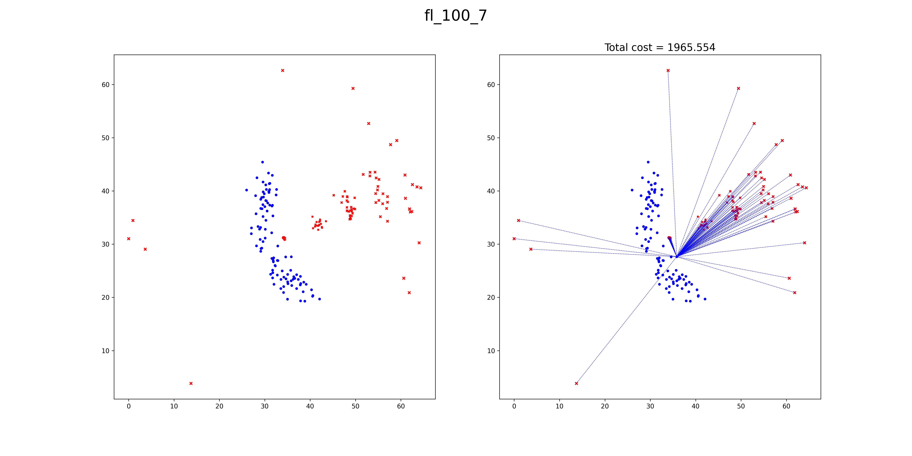
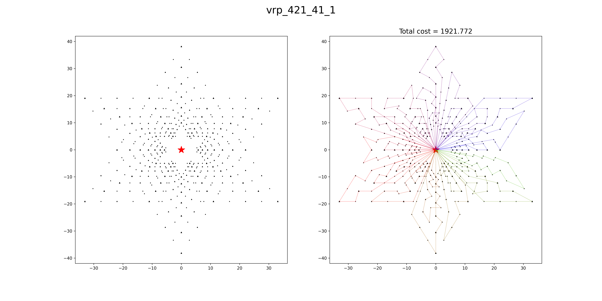

## My workspace for Coursera Discrete Optimiztion - [[Certificate](https://www.coursera.org/account/accomplishments/verify/YXTNUBC3G3LX)]

#### 2_knapsack: 60/60
- Small set: Dynamic Programming
- Bigset: Branch amd Bound dfs

#### 3_coloring: 48/60

#### 4_tsp
- Smallset: Bitmask Dynamic Programming
- Heuristic + Local Search

#### 6_facility:
- Smallset: MIP solver
- Bigset: Kmean Clustering + MIP solver

#### 7_rvp
- Smallset: MIP solver
- Bigset: Petal Clustering + MIP Solver

## Resources
- [https://www.coursera.org/learn/discrete-optimization](https://www.coursera.org/learn/discrete-optimization)
- [https://github.com/discreteoptimization](https://github.com/discreteoptimization)
